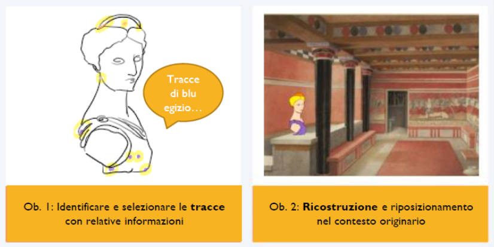
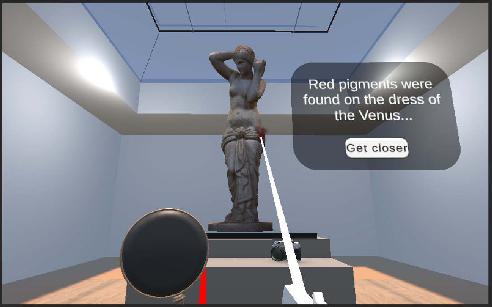

# Oltre-il-Bianco
Final Project for the "Laboratorio di Realtà Aumentata e Virtuale" within the DHDK Master's Degree at University of Bologna

## Table of content 
- [**Introduzione**](#intro)
- [**Design e Scelte tecniche**](#design)
- [**Architettura**](#softarchi)

## 1. Introduzione 
<b>Oltre il bianco</b> è un progetto di Realtà Virtuale pensato per essere giocato sia da remoto sia all’interno di una sala del museo appositamente attrezzata. L’obiettivo è aiutare i visitatori dei musei, gli appassionati d’arte e finanche un pubblico più esperto a riscoprire la policromia della statuaria classica. Le tracce di colore rimaste sulle statue sono spesso invisibili all’occhio nudo, e necessitano dell'ausilio di microscopio o analisi diagnostiche che coinvolgono filtri (UV e IR) e condizioni di luce particolari che non sarebbe possibile ricreare per i visitatori.

## 2. Design e Scelte tecniche 
<b>2.1 Studio degli Use Case</b>
Il progetto è stato pensato a seguito di analisi mirate su gruppi di pubblico dei musei, riguardo ciò che questi si aspettano di vedere o gli aspetti da cui sono maggiormente  incuriositi riguardo specificatamente il tema della policromia della scultura classica. 
Per innescare la curiosità, i fattori scatenanti più efficaci da tenere in considerazione sono risultati:
la novità delle informazioni, l'aspetto inaspettato della ricerca, il mistero alla base della perdita del colore e l'incognita del perché qualcosa è visibile e qualcosa è andato perduto;
la necessità di concentrarsi sul processo lavorativo della ricerca, facendo indossare ai visitatori i panni dei ricercatori e accompagnandoli passo dopo passo alla scoperta della policromia perduta;
L'aspetto sperimentale delle analisi e il loro esito sono stati l'aspetto più significativo per innescare la curiosità dei visitatori, anche se non spiegati nei minimi dettagli; 
Far vedere la ricostruzione, chiarendo che si tratta solo di un' ipotesi e contestualizzandola all'interno dell'ambiente colorato in cui si trovava in origine.

<b>2.2 Perchè la Realtà Virtuale?</b>
La Realtà Virtuale permetterà di visualizzare le analisi, le tracce e le varie possibili ricostruzioni della policromia. La Realtà Virtuale è uno strumento estremamente efficace per reinserire le possibili ricostruzioni all’interno di ricostruzioni del contesto originario, abbattendo la percezione di estraneità e falsità da parte dei visitatori.
 

## 3. Architettura 
Il progetto è stato testato sfruttando XR Device Simulator, e si basa sul pacchetto di Unity XR Toolkit. 
Non appena avviato il gioco si apre con un XR Canva che lo accoglie e gli indica lo step successivo, nonché gli presenta la struttura della stanza in cui si trova e le attività che l’utente potrà effettuare.
- Teleport Areas: tutti i cerchi blu poggiati sul pavimento consentono di essere teletrasportati quando puntati. Come sistema di movimento supplementare, è stato poi aggiunto la funzionalità di Snap Turning, impostando il grado di rotazione a 30° per limitare la motion sickness 
- XR Grabbable Objects: per analizzare la statua è possibile usare due strumenti, che compaiono davanti al giocatore non appena si trova nella posizione corretta davanti alla statua. I due strumenti (lente di ingrandimento e macchina fotografica) attivano le rispettive zone di analisi (microscopio e VIL)
- XR Simple Interactable: una volta preso uno degli strumenti sulla statua compaiono delle particles colorate in corrispondenza dei punti di analisi, che se hovered mostrano informazioni e immagini delle analisi effettuate.  
Terminate le analisi all’interno della stanza, si rende visibile un’altra zona di teletrasporto di fronte a una porta, che una volta aperta trasporta l’utente nella ricostruzione del tempio dove era un tempo collecta la statua esaminata. Oltre a vederla contestualizzata, la statua può poi essere ricolorata attivando la funzione ChangeMaterial.cs che sostituisce la texture attuale con la versione ricolorata, plausibile ipotesi dell’originale.

## 4. Difficoltà tecniche 
L’attivazione e la scomparsa delle UI e degli oggetti potrebbe essere più morbida, e si potrebbe introdurre un effetto fading. Questo progetto è stato attualmente testato solamente usando il simulatore, ma sarebbe necessario testare con un’adeguata strumentazione VR e visore, così da migliorare la visione delle varie canvas presenti nel gioco. 

